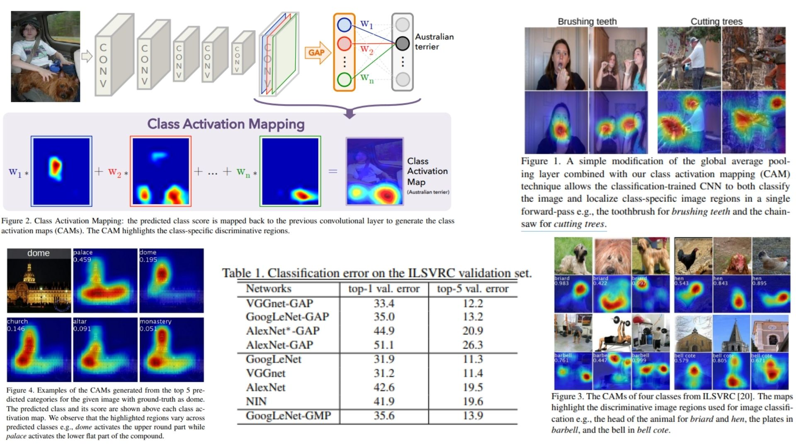

# 📸 CAM-Replication — Class Activation Mapping for Image-Level Localization

This repository provides a **faithful Python replication** of the **Class Activation Mapping (CAM) framework** for image-level object localization.  
The code implements the pipeline described in the original paper, including **CNN feature extraction, global average pooling, and class-specific activation mapping**.

Paper reference: *[Learning Deep Features for Discriminative Localization](https://arxiv.org/abs/1512.04150)*  

---

## Overview 🎯



> The pipeline extracts **convolutional feature maps** from the CNN backbone, applies **global average pooling (GAP)**, and generates **class-specific activation maps** highlighting discriminative regions for the predicted class.

Key points:

* **CNN backbone**: extracts feature maps $$F_l(x)$$ from conv layers  
* **Global Average Pooling (GAP)**: summarizes spatial features $$f_c = \frac{1}{H W} \sum_{i,j} F_{c,i,j}$$  
* **Classifier head**: fully connected layer outputs class scores $$s_c = w_c^\top f + b_c$$  
* **Class Activation Map (CAM)**:  $$M_c(i,j) = \sum_k w_{c,k} F_{k,i,j}$$  
* **Localization**: upsample CAM to input size to highlight object regions  

---

## Core Math 📐

**Feature maps from backbone**:

$$
F = \text{CNN}(x) \in \mathbb{R}^{C \times H \times W}
$$

**Global Average Pooling (GAP)**:

$$
f_c = \frac{1}{H W} \sum_{i,j} F_{c,i,j}
$$

**Class scores**:

$$
s_c = \sum_k w_{c,k} f_k + b_c
$$

**Class Activation Map**:

$$
M_c(i,j) = \sum_k w_{c,k} F_{k,i,j}
$$

**Normalization for visualization**:

$$
\hat{M}_c = \frac{M_c - \min(M_c)}{\max(M_c) - \min(M_c)}
$$

---

## Why CAM Matters 🌿

* Provides **class-specific discriminative regions** without pixel-level labels 🎨  
* Simple yet effective for **weakly-supervised localization** 🧩  
* Can be applied to **any CNN backbone** (AlexNet, VGG, GoogLeNet) 🖥️  

---

## Repository Structure 🏗️

```bash
CAM-Replication/
├── src/
│   ├── backbone/
│   │   ├── alexnet_conv.py           # AlexNet conv blocks (conv1 → conv5)  
│   │   ├── vgg_conv.py               # VGG conv blocks (conv1_1 → conv5_3)  
│   │   └── googlenet_conv.py         # GoogLeNet inception blocks (inception1 → inception4e)  
│   │
│   ├── layers/
│   │   ├── conv_block.py             # Conv + ReLU + BatchNorm  
│   │   └── gap.py                    # Global Average Pooling layer  
│   │
│   ├── head/
│   │   └── classifier_head.py        # GAP → FC → sigmoid/softmax for class scores  
│   │
│   ├── model/
│   │   └── cam_model.py              # Backbone + GAP + classifier + CAM  
│   │
│   └── config.py                     # Hyperparameters, backbone choice, num_classes  
│
├── images/
│   └── figmix.jpg                    
│
├── requirements.txt
└── README.md
```

---

## 🔗 Feedback

For questions or feedback, contact:  
[barkin.adiguzel@gmail.com](mailto:barkin.adiguzel@gmail.com)
